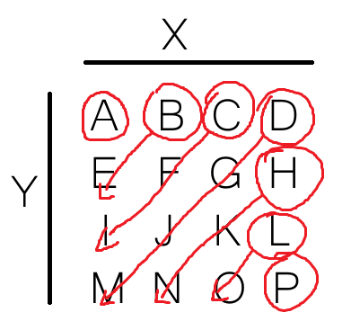
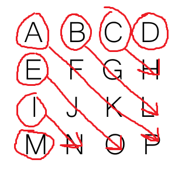

$$
\begin{matrix}
         & _{0} & _{1} & _{2} & _{3} \\
    _{0} &   A  &   B  &   C  &   D  \\
    _{1} &   E  &   F  &   G  &   H  \\
    _{2} &   I  &   J  &   K  &   L  \\
    _{3} &   M  &   N  &   O  &   P    
\end{matrix}
$$

(!) points are determined as (y,x) insted of (x,y) because of array access ( arr[y][x] )

# Linear function diagonal traverse
First we transfor matrix above to points in cartesian system.

$$
\begin{matrix}
    _{3} &   M  &   N  &   O  &   P  \\  
    _{2} &   I  &   J  &   K  &   L  \\
    _{1} &   E  &   F  &   G  &   H  \\
    _{0} &   A  &   B  &   C  &   D  \\
         & _{0} & _{1} & _{2} & _{3}
\end{matrix}
$$

Now we determine the equation of diagonal lines with slope equal to -1 with coefficient b as parameter where n is number of rows in matrix:

$$
         y = -x + b
$$
$$
         b \in \langle 0;2n - 1)
$$

And secound equation for opposite lines with slope equal to 1:

$$
y = x + b
$$
$$
b \in \langle 1-N;n)
$$

Now we make make 2 nested loops with all possible b,x,y values and put them into both equazions checking if they solve.

```python
    for b in range(0,2*n-1):
        for y in range(0,n):
            for x in range(0,n):
                if y == -1*x + b: 
                    # get element from array
                    # arr[y][x]

     for b in range(1-n,n):
        for y in range(0,n):
            for x in range(0,n):
                if y == x + b: 
                    # get element from array
                    # arr[y][x]
```
As a resoult we get this valuses:
```
A
EB
IFC
MJGD
NKH
OL
P

D
CH
BGL
AFKP
EJO
IN
M
```
Problem with this solution is the unnecessary calculations for points that we have already searched and the time complexity of $O(n^{3})$.

# Second aproach

$$
\begin{matrix}
         & _{0} & _{1} & _{2} & _{3} \\
    _{0} &   A  &   B  &   C  &   D  \\
    _{1} &   E  &   F  &   G  &   H  \\
    _{2} &   I  &   J  &   K  &   L  \\
    _{3} &   M  &   N  &   O  &   P    
\end{matrix}
$$

We will define $X$ as matrix's number of columns and $Y$ as number of rows. <br>
Firstly we define starting cooridnates of diagonal lines which are $A,B,C,D,H,L$ and $P$ with values of y and x: $(0,0) , (0,1) , (0,2) , (0,3) , (1,3) , (2,3) , (3,3)$. <br>
As we can observe firstly $x$ is rising from $0$ to $X-1$ then it stays constant and $y$ starts to rise up to $Y-1$. We can code it as:
``` python
xs,ys = 0,0
while ys < Y:
    
    ...

    if xs < X-1: xs+=1
    else: ys+=1
```
We name variables as $x_s$ and $y_s$ to remind us that they are starting coordinates. <br><br>
 <br>
Now we want to go down on $x$ and up on $y$ to determine diagonals as presented in image above.
```python
xs,ys = 0,0
while ys < Y:
    x,y = xs,ys
    while x >= 0 and y < Y:
        x-=1
        y+=1
    if xs < X-1: xs+=1
    else: ys+=1
```
As presented above we decrement $x$ and increment $y$ in each loop iteration and check if $x$ or $y$ dont go out of range. Now to finish our task we need array to store our current diagonal values and resets when we change starting coordiates. In code below we will store chars in a string variable. We also are going to print every diagonal.
```python
xs,ys = 0,0
while ys < Y:
    x,y = xs,ys
    s = ""
    while x >= 0 and y < Y:
        s += arr[y][x]
        x-=1
        y+=1
    if xs < X-1: xs+=1
    else: ys+=1
    print(s)
```
As a resault we get:
```
A
BE
CFI
DGJM
HKN
LO
P
```
To get opposite diagonals we need to adjust some parameters and if statments. Firstly we need to change starting point $y_s$ from $0$ to $Y-1$. Now we start diagonals like that: $M,I,E,A,B,C,D$ with coords: $(3,0) , (2,0) , (1,0) , (0,0) , (0,1) , (0,2) , (0,3)$.
<br> 
So in each iteration $x$ and $y$ are incremented and we need to check if their valus dont go over $X-1$ and $Y-1$. As now the first starting coordinate $y_s$ drops from $Y-1$ to $0$ and than $x_s$ rises from $0$ to $X-1$ we need to change condition of first while loop and condition of if statement and its body.
```python
xs,ys = 0,Y-1
while xs < X:
    x,y = xs,ys
    s = ""
    while x < X and y < Y:
        s += arr[y][x]
        x+=1
        y+=1
    if ys > 0 : ys -= 1
    else: xs += 1
    print(s)
``` 
After launching both codes we get:
```
A
BE
CFI
DGJM
HKN
LO
P

M
IN
EJO
AFKP
BGL
CH
D
```
This methode has $O(n^{2})$ time complexity.
